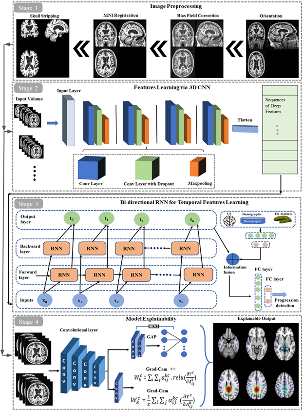

## Alzheimer disease progression detection from longitudional MRI
This is the Pytorch implementation of the paper "Alzheimer’s disease progression detection based on multimodal deep learning model and visual explainability of time series data". 

## Prerequisites:
* [Python3](https://www.python.org/)
* [Pytorch](https://pytorch.org/)
* [NiBabel](https://nipy.org/nibabel/)

## Proposed Framework:
The proposed framework (3D-CNN-BRNN) is composed of four stages. <i>Stage 1</i> shows the image preprocessing step which includes reorientation of the input volume to standard space, intensity inhomogeneity (bias field) correction, MNI template space registration, and skull stripping. <i>Stage 2</i> is 3D CNN module to extract deep features for the input 3D MRI volume. Extracted features are then forwarded to <i>Stage 3</i> that is bidirectional RNN to capture the temporal features from the extracted sequences in <i>Stage 2</i>. In <i>stage 4</i> visual explanation to spatial and temporal features are provided. This step further validates the generalization of the proposed network that is medically acceptable from the domain expert.



## Work flow:


## Activated brain regions in longitudional MRI data


## Data prepration:
Please save the MRI ".npy" data into CN and AD folders, respectively. You can use the "data preprocessing/Baseline_volumes.py" for the baseline or "data preprocessing/BaselineMRI + M06MRI_volumes (two_timesteps).py" or BaselineMRI + M06MRI + M12MRI_volumes (three_timesteps).py" to prepare the data for multiple timesteps accordingly.

## Training-Testing:
After data preparation, any model (Proposed network, 3DVGG, 3DResNet) with any data combination can be trained and test with the provided code. Such as code for traininig-testing  proposed network with the baseline MRI data can be found in directory "ProposedNet/ProposedNet_at_BaselineMRI.py".  


## Citation
We would appreciate if you consider citing our work when using our code.

```bibtex
@article{RAHIM2023363,
title = {Prediction of Alzheimer's progression based on multimodal Deep-Learning-based fusion and visual Explainability of time-series data},
journal = {Information Fusion},
volume = {92},
