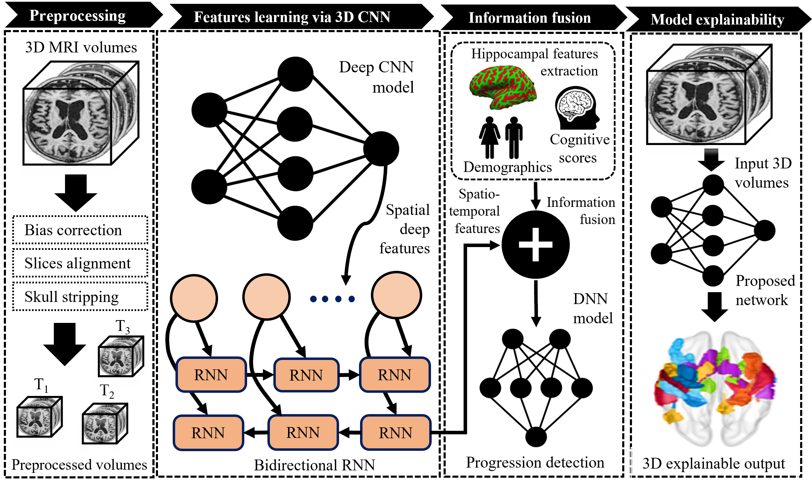
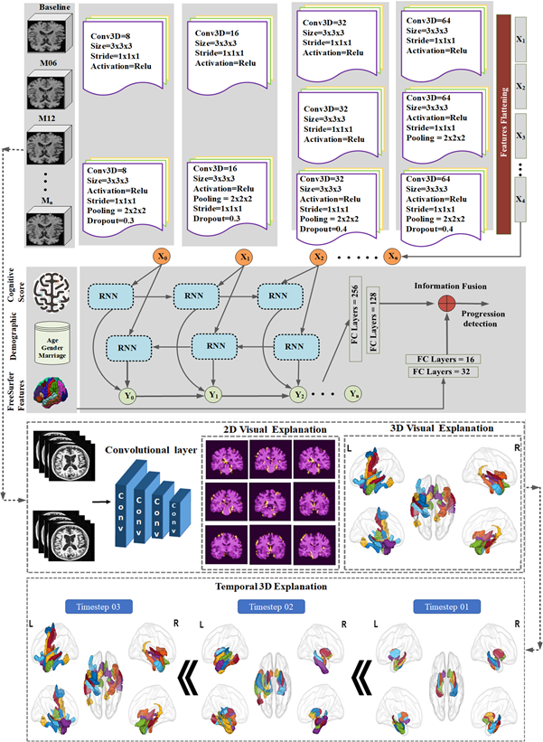
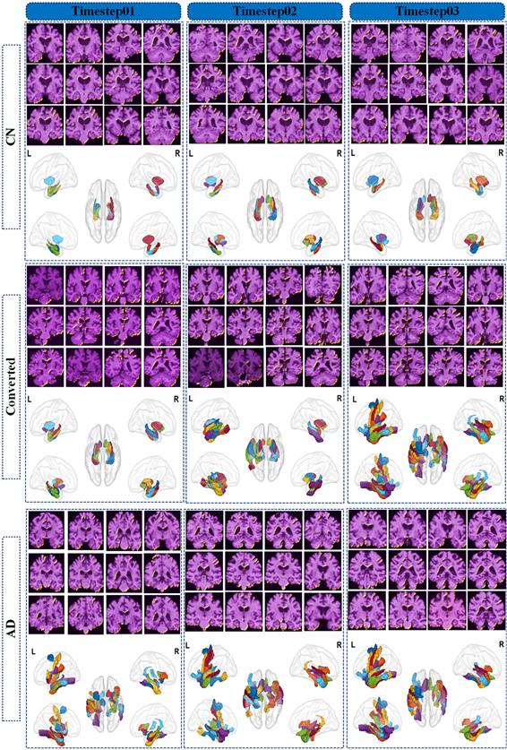

## Alzheimer disease progression detection from longitudional MRI
This is the Pytorch implementation of the paper "Alzheimer’s disease progression detection based on multimodal deep learning model and visual explainability of time series data". 

## Prerequisites:
* [Python3](https://www.python.org/)
* [Pytorch](https://pytorch.org/)
* [NiBabel](https://nipy.org/nibabel/)

## Abstract: 
Alzheimer's disease (AD) is a neurological illness that causes cognitive impairment and has no known treatment. The premise for delivering timely therapy is the early diagnosis of AD before clinical symptoms appear. Mild cognitive impairment is an intermediate stage in which cognitively normal patients can be distinguished from those with AD. In this study, we propose a hybrid multimodal deep-learning framework consisting of a 3D convolutional neural network (3D CNN) followed by a bidirectional recurrent neural network (BRNN). The proposed 3D CNN captures intra-slice features from each 3D magnetic resonance imaging (MRI) volume, whereas the BRNN module identifies the inter-sequence patterns that lead to AD. This study is conducted based on longitudinal 3D MRI volumes collected over a six-months time span. We further investigate the effect of fusing MRI with cross-sectional biomarkers, such as patients’ demographic and cognitive scores from their baseline visit. In addition, we present a novel explainability approach that helps domain experts and practitioners to understand the end output of the proposed multimodal. Extensive experiments reveal that the accuracy, precision, recall, and area under the receiver operating characteristic curve of the proposed framework are 96%, 99%, 92%, and 96%, respectively. These results are based on the fusion of MRI and demographic features and indicate that the proposed framework becomes more stable when exposed to a more complete set of longitudinal data. Moreover, the explainability module provides extra support for the progression claim by more accurately identifying the brain regions that domain experts commonly report during diagnoses.



## Proposed Framework:
In this study, we propose a framework that uses a deep 3D CNN followed by a bidirectional recurrent neural network (3D-CNN-BRNN) to predict the progression of AD. We optimize a hybrid DL model that combines the capabilities of 3D CNNs, recurrent neural networks (RNNs), and feed-forward neural networks, outperforming models in previous studies. Our architecture relies on longitudinal 3D MRI volumes recorded over three time steps (BL, month 6 (M06), and month 12 (M12)). Given these data, our model can predict the medical condition of a patient three years later (i.e., at month 48 (M48)). The designed framework is an end-to-end DL model in which the 3D CNN module captures inter- and intra-slice features of 3D volumes by analyzing a patient’s time-series volumes to produce a latent representation of convolutional features. Unlike previous studies, the BRNN module was precisely designed to track inter-volumetric relationship features extracted from a 3D CNN module that evolves over different time steps. Furthermore, we also studied the effect of fusing other critical modalities, such as demographic and cognitive biomarkers recorded at the BL, with the deep features extracted from the 3D-CNN-BRNN model for AD progression detection. Medical experts are interested in determining reasons for specific medical decisions. XAI helps models elicit understandable explanations of their output to different audiences. To the best of our knowledge, the time-series visual explainability of 3D MRI neuroimages has not been explored in the literature on AD. After optimizing the DL-based model to achieve its best performance, we extended the model to provide time-series explainability using visual representations over 3D images to further justify the model’s decision. This module tracks the regions in the brain tissue over time to help the model recognize patients with AD. The proposed approach addresses both issues by choosing the guided Grad-CAM, which provides voxel-level activation maps as we go through each time step of the 2D MRI slices. 


## Work flow:


## Activated brain regions in longitudional MRI data


## Data prepration:
Please save the MRI ".npy" data into CN and AD folders, respectively. You can use the "data preprocessing/Baseline_volumes.py" for the baseline or "data preprocessing/BaselineMRI + M06MRI_volumes (two_timesteps).py" or BaselineMRI + M06MRI + M12MRI_volumes (three_timesteps).py" to prepare the data for multiple timesteps accordingly.

## Training-Testing:
After data preparation, any model (Proposed network, 3DVGG, 3DResNet) with any data combination can be trained and test with the provided code. Such as code for traininig-testing  proposed network with the baseline MRI data can be found in directory "ProposedNet/ProposedNet_at_BaselineMRI.py".  


## Citation
We would appreciate if you consider citing our work when using our code.

```bibtex
@article{RAHIM2023363,
title = {Prediction of Alzheimer's progression based on multimodal Deep-Learning-based fusion and visual Explainability of time-series data},
journal = {Information Fusion},
volume = {92},
